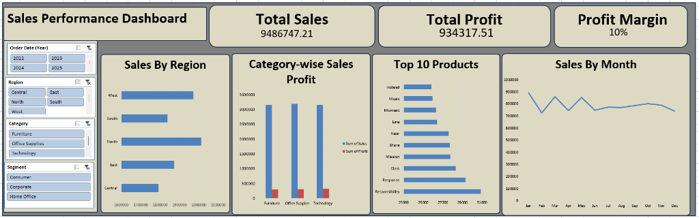
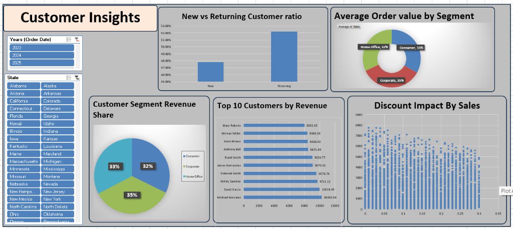
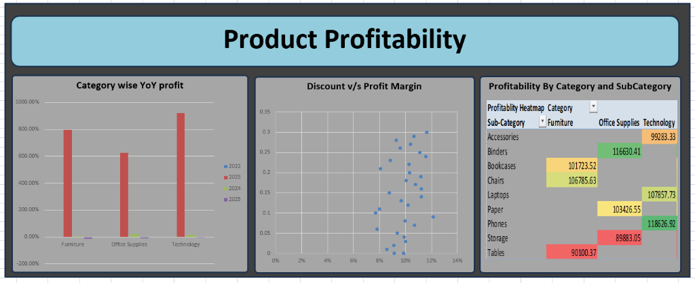

# 🌍 Global Retail Sales Dashboard

## 📌 Project Overview

An end-to-end **Excel data analytics project** focused on analyzing global retail sales performance, regional sales, product categories, revenue, and profit margins.

The project transforms transactional retail data into meaningful business insights using **Excel formulas, Pivot Tables, KPIs, charts, and interactive dashboard views**.

---

## 📸 Dashboard Previews

### 1. Sales Performance Dashboard


### 2. Customer Insights Dashboard


### 3. Product Profitability Dashboard


---

## 🎯 Project Objectives

* Analyze overall retail sales performance.
* Track sales and profit across different regions.
* Identify top-performing product categories.
* Analyze revenue and profit margins.
* Compare regional and category-wise performance.
* Identify key trends and business opportunities.
* Build an interactive Excel dashboard for data-driven decision-making.

---

## 🛠️ Tools & Techniques

* **Microsoft Excel**
* Pivot Tables
* Pivot Charts
* Excel Formulas
* KPI Cards
* Interactive Filters / Slicers
* Data Cleaning & Transformation
* Data Visualization

---

## 📂 Project Structure

```text
Global Retail Sales Dashboard/
│
├── 📊 Excel-dashboards-project.xlsx
│   └── Main Excel analysis and interactive dashboard
│
├── 📄 Problem Statement .docx
│   └── Project problem statement and requirements
│
├── 📁 assets/
│   ├── sales_performance_dashboard.png
│   ├── customer_insights_dashboard.png
│   └── product_profitability_dashboard.png
│
└── 📄 README.md
    └── Project documentation
```

---

## 🔄 Project Workflow

```text
Raw Retail Data
      ↓
Data Cleaning & Preparation
      ↓
Data Analysis
      ↓
Pivot Tables
      ↓
KPI Creation
      ↓
Charts & Visualizations
      ↓
Interactive Dashboard
      ↓
Business Insights
```

---

## 📊 Dashboard Analysis

The dashboard provides insights into:

* **Total Sales:** Overview of total revenue generated across all regions and categories.
* **Total Profit & Profit Margin:** Breakdown of net profit and profit margin percentage.
* **Regional Sales Performance:** Comparison of sales across West, East, North, South, and Central regions.
* **Product Category Performance:** Analysis of Furniture, Office Supplies, and Technology.
* **Sales Trends:** Monthly sales progression throughout the year.
* **Customer Insights:** New vs. Returning customer ratio, segment revenue share, top 10 customers by revenue, and discount impact analysis.
* **Product Profitability:** YoY category profit, discount vs. profit margin correlation, and profitability heatmaps by sub-category.

Interactive dashboard elements allow users to filter and explore the data from different perspectives using slicers (Year, Region, Category, Segment, State).

---

## 🔍 Key Business Insights

The analysis helps identify:

* High-performing regions and markets.
* Most profitable product categories.
* Sales and profit trends over time.
* Regions requiring strategic improvement.
* Products and top customers contributing significantly to overall revenue.
* Impact of discount strategies on profit margins.

---

## 💡 Business Value

The dashboard converts raw transactional data into an easy-to-understand visual report that can support:

* Sales strategy planning
* Regional performance monitoring
* Product performance evaluation
* Profitability analysis
* Data-driven business decisions

---

## 📁 Project Files

* **Excel Dashboard (`Excel-dashboards-project.xlsx`):** Contains the complete analysis, Pivot Tables, KPIs, charts, and interactive dashboard sheets.
* **Problem Statement (`Problem Statement .docx`):** Defines the business requirements and objectives of the project.
* **Assets (`assets/`):** Contains dashboard screenshot previews.

---

## 👩‍💻 Author

**Rishita Choksi**

**Data Analytics | Excel | SQL | Python | Power BI**

⭐ Explore the Excel dashboard to understand global retail sales and profitability performance.
